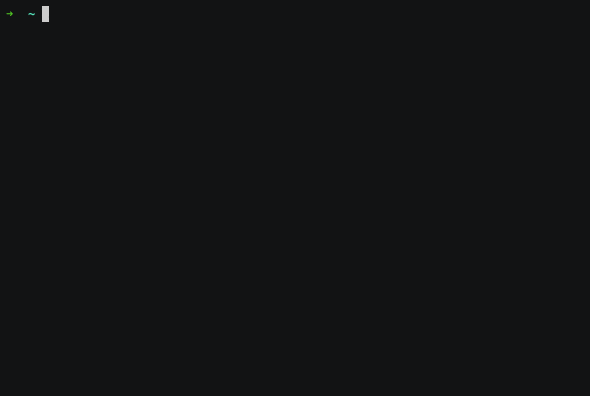

# Project "Brain games"

[](https://codeclimate.com/github/deputatov/frontend-project-lvl1/maintainability)
[](https://travis-ci.org/deputatov/frontend-project-lvl1)

Project [frontend-project-lvl1](https://ru.hexlet.io/professions/frontend/projects/44) has implemented a set of mini games launched from the console.

Mentor [Sergey Karpuk](https://ru.hexlet.io/u/ck)

## Install package

```$ sudo npm i -g frontend-project-lvl1-deputatovn```

<p align="center">  </p>

## Game "Is even number?"

User sees a random number. He needs to answer **yes** if the number is even, or **no** if it is odd.

run game ```$ brain-even```

<p align="center">  </p>

## Game "Calculator"

User sees a random mathematical expression that needs to be calculated and written down the correct answer.

run game ```$ brain-calc```

<p align="center">  </p>

## Game "Greatest common divisor"

User sees two random numbers. He must calculate and enter the largest common divisor of these numbers.

run game ```$ brain-gcd```

<p align="center">  </p>

## Game "Arithmetic progression"

User sees a series of numbers forming an arithmetic progression, one of which is represented by two points. He must determine and enter this number.

run game ```$ brain-progression```

<p align="center">  </p>

## Game "Is prime number?"

User sees a random number. He needs to answer **yes** if the number is prime, or **no** if not.

run game ```$ brain-prime```

<p align="center">  </p>
